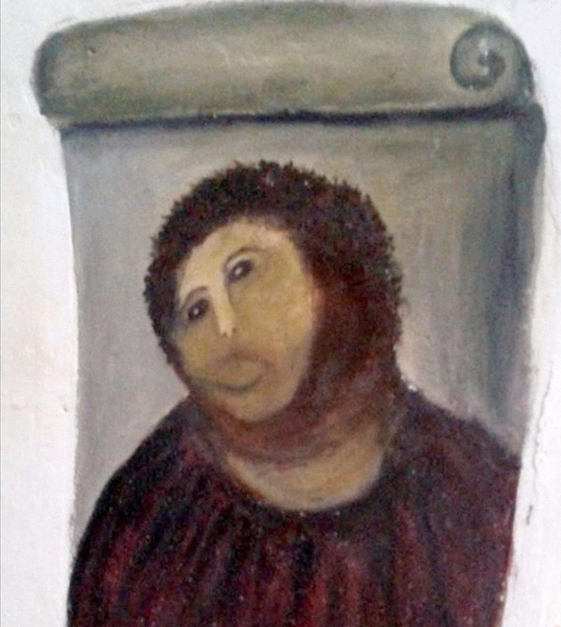

# Assignment

<!--
### Resources
You can use the reader (VCD) and our lectures as resource material. We will explain all the basics of perception and design. If you need more resources I recommend Visual Thinking for Design (perception & design) and Ways of Seeing (meaning).  
-->

The assignment consists of three parts, in the first you will apply your theoretical understanding to the **analysis** of images (works of art), in the second you will perform empirical **evaluations** and in the third part you will **create** code based visual based on the previous parts. Before starting the assignment, you will choose 6 images from our <a href="{{site.baseurl}}/selection2020">selection</a>. We carefully curated a set of interesting works that fit the course' context well. You will start with 6 images in the first part part 1, 2 for second part and 1 for the last part:

## General assesment criteria
We will use the CoNTRoL assesment criteria also used in [Context and Conceptualisation](https://studiegids.tudelft.nl/a101_displayCourse.do?course_id=36962): Clear, New, True, Relevant and Like. In each part we use a selection of these criteria, specified below. 

* * *
## Part 1

### Introduction
Gombrich (1972) distinguishes between the *expressive*, *arousing* and *descriptive* function of images. In ‘A Primer of Visual Literacy’ (1973) Donis A. Dondis breaks down the expression and reception of visual messages on three levels of information retrieval: representation, abstraction and symbolism. All of  these levels “are interconnected and overlapping, but can be sufficiently distinguished from each other so that they can be analysed both as to their value as potential tactics for message-making and their quality in the process of seeing.” Furthermore, during the lectures and in the book we discussed the perceptual (what?), technical (how?) and contextual ingredients (when, where and why?) of visual communication. Taken together, we have a list of visual communication elements:

* Expressive: What was the intention of the artist/designer? 
* Arousing: Who is it made for and how is it received? 
* Descriptive: What information is transmitted? 
* Representationally: What can be seen and recognised?
* Abstractly: Which more direct, emotional, and primitive message-making means are used?
* Symbolically: Which coded symbol system can be deciphered?
* Perceptual: What ingredients, such as color, texture and space are used?
* Technical: What media are used, how is it made?
* Contextual: What is the historical, social (economical) and cultural context?

Take notice that this list is *interconnected, overlapping and incomplete*. UPDATE, we made a [google doc](https://docs.google.com/document/d/1DXR6YJvkKFGXYpCBWHJ_l7DvIVPb6xvPAWK_nSsrElE/edit?usp=sharing) where we changed the order of the elements a bit, and gave some example questions that could be answered. 

### Learning outcomes
You will become critically aware of the visual world around you. You will be able to name and explain technical elements of images. You will know how these technical elements relate to the human visual system (eyes and brain) and therefore predict what information is communicated. Lastly, you will gain understanding about the role of visual communication in historical and contemporary society.  

### Instructions

Select 6 images from our <a href="{{site.baseurl}}/selection2020">selection</a> that you will analyse using the 9 elements mentioned above, in the introduction. 

**First** you will analyse these elements individually. You do not have to discuss all 9 elements for each image, only when they are relevant. But try to at least discuss each element at least once.

**Second**, you will synthesize the analysis by discussing connections between any of the elements. You are free in choosing which combinations. 

<!--You are free to choose 6 images from the selection we made for you. We suggest to base your selection on:
* your personal interest
* affords different types of analysis
* seem potentially interesting for Part 2 (empirically evaluation)-->

### Deliverables
Use one A4 for each image with a maximum of 250 words. Illustrations can support your argumentation. The 6 A4 pages should be bundled in 1 pdf file. Please make sure that this file does not exceed 20Mb. You can use ‘reduced filesize’ options in Adobe, for example. The purpose here is twofold: 1) my hard disk is limited and 2) some of you need to gain awareness of file size management 🤔, it will look unprofessional if you would send out a 200Mb portfolio, for example. 

### Assessment criteria
For Part 1 we will use the following criteria:
* True: does the analysis apply to the image? 
* Clear: is the analysis presented in an understandable way?
* New: did you create novel insights (from the synthesis).

UPDATE: The Rubric

<!--### Rubric
-->

### Dates
- Draft: 20-mar-2020
- Video feedback: 23-mar-2020
- Final: 30-mar-2020

* * *
## Part 2

### Learning outcomes
After this part, you will be able to prepare, conduct and interpret empirical research related to visual communication. You will become familiar with standard paradigms such as visual search, change blindness, eye & mouse tracking, conspicuity, etc. You will know the strength but also weaknesses of empirical research and able to assess empirical results critically. 

### Instructions
Choose 2 images from the 6 you used in part 1. Formulate hypotheses for which you need empirical insight and explain the connection between hypothesis and paradigm (= the type of experiment). Use 2 different paradigms in each image, so you can also reflect on different types of information you can extract. Go to the (<a href="{{site.baseurl}}/paradigms">experimental paradigms</a>) page for more info, but be warned: you do not _have_ to use these, feel free to come up with your own ways of evaluating. 

### Deliverables
A 4 page pdf (2 pages per image) that includes the following (brief) sections:
- Image name
- Question (either a hypothesis or explorative question)
- Experimental paradigm
- Method (how many observers, what procedure etc)
- Result (some text and graphs)
- Discussion (interpretation of results)

### Assessment criteria
For Part 2 we will use the following criteria:
* Relevant: is the hypothesis meaningful? 
* Clear: are the results clearly presented?
* True: is the interpretation of results critical? 

UPDATE: The Rubric

### Dates
- Draft: 27-mar-2020
- Video feedback: 30-mar-2020
- Final: 6-apr-2020

* * *
## Part 3

### Learning outcomes
In the last part you will learn how to use code for visual sketching. We will use [P5js.org](https://P5js.org), a javascript version of Processing that is used by many artists and designers. You will learn how to create a code based image, what interactions are possible and how (machine learning) libraries work. 

### Instructions
You now select one image that you will use as a starting point for your P5 sketch. In this sketch, you are relatively free to communicate an insight about the work of art you choose for this last part of the assignment. This can be (partly) based on the insights you explicitly gained in the analysis (I) and/or evaluation (II) part, but it can also be something else you discovered.  

### Deliverables
A 1 page pdf that contains a reflecton about how you approached the problem and what kind of iterations you went through. Word limit is 300 words. It should also include a link using Share ➡️ Fullscreen, for example [https://editor.p5js.org/maartenwijntjes/full/sCLGJg6H](https://editor.p5js.org/maartenwijntjes/full/sCLGJg6H). 

### Assessment criteria
For Part 3 we will use the following criteria:
* New: combines or creates something new
* Relevant: reflection
* Like: 🙂

UPDATE: The Rubric

### Dates
- Draft: 3-apr-2020
- Video feedback: 6-apr-2020
- Final: 13-apr-2020

<!--

:-------------------------:|:-------------------------:
 Cecilia BenoCeciliazzo  |  Benozzo Benozzo Benozzo 

-->

<!--
The assignment consists of 3 parts: analysis, evaluation and creation. You can read everything in the pdf link below. Furthermore, you need to choose 10 works from a total of 30, from every column you need to choose 1. 
* [Assignment](content/assignment_final_improved_for_clarity.pdf)
* [Source material](content/SourceMaterial.zip) where you find a pdf with all images, a table with names and the images themselves. 
-->
