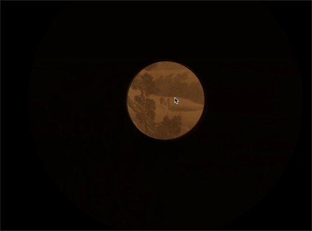
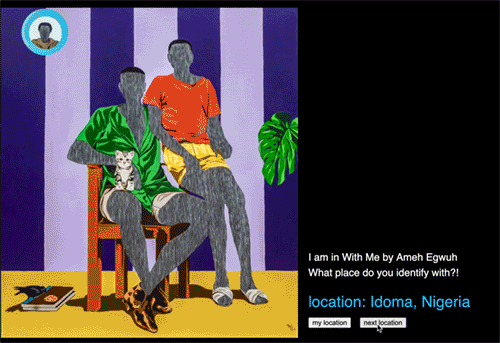
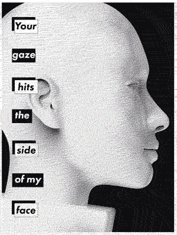
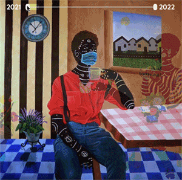
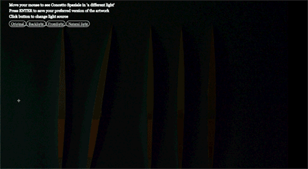
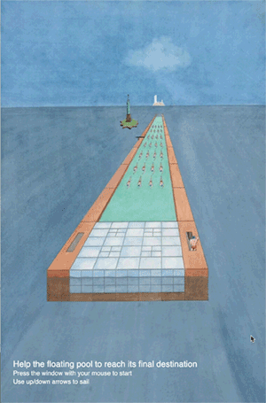

<!---->

## Introduction

Welcome to the online syllabus for Visual Communciation Design, a course for Design for Interaction (DfI) Master program students, and anyone else interested. The learning objectives of this course are to *analyse*, *evaluate* and *create* visual communication:

1.	Learn to analyse existing visual communication designs.
2.	Apply emperical methods to quantify visual information communication. 
3.	Visually communication with code (with P5.js).

<!--
The learning activities (assignments) each address a specific learning goal:

1.	Choose and study a set of images based on theories about perception and depiction.
2.	Design and conduct visual tests with a (small) group of observers, analyse and interpret data.  
3.	Learn to read, adept and write P5.js sketches during practical training and online courses. 

-->

## Course material

See Brightspace for reading material and lectures. 

<!--
* **Vision and Depiction** by Wijntjes & (a little bit of) Middelkoop. It is a draft version of the book we are working on. Besides a good outline/summery of the lectures it include spelling mistakes, repetitions, unfinished paragraphs and dead hyperlinks: feel free to notify us about unclarities. 
* [**Visual Thinking for Design**](https://www.amazon.com/dp/0123708966/ref=rdr_ext_tmb) by Colin Ware (Recommended). This has been a major inspiration source when teaching this course over the past years. He also wrote the bit more advanced book [Information Visualization - Perception for Design](https://www.amazon.com/dp/0123814642/ref=rdr_ext_tmb) that you should certainly check out when diving deeper in the topic of data visualization. 
* **Ways of Seeing** by John Berger (Recommended), either in [book form](https://www.amazon.co.uk/dp/014103579X/ref=rdr_ext_tmb) or from his [BBC series](https://youtu.be/0pDE4VX_9Kk).
* **A Primer of Visual Literacy** by Donis A. Dondis (Recommended).
-->

## Course results 2021

Every year we study existing visual works from three perspectives: theoretical analysis, empirical psychological experiments and visual design in p5.js. Below you will see a very small selection of that last part, the p5.js creations.  Students started the course choosing from [this](/selection2021) and all p5.js results can be found  [here](/output2021). Below you can see 8 examples, including GIFs and links. I should mention this is not necessarily the top 8 but they are all very good and give a nice first impression. 
 
:-------------------------|:-------------------------
:-------------------------|:-------------------------
 [source](https://images.google.com/searchbyimage?image_url=https://visualcommunicationdesign.github.io/content/2021/12.jpg)| [P5 sketch](https://editor.p5js.org/VeryFatCat/full/LDdK4hnI_)
:-------------------------|:-------------------------
 [source](https://images.google.com/searchbyimage?image_url=https://visualcommunicationdesign.github.io/content/2021/16.jpg)| [P5 sketch](https://editor.p5js.org/Ronne/full/7u10Zulv2)
:-------------------------|:-------------------------
 [source](https://images.google.com/searchbyimage?image_url=https://visualcommunicationdesign.github.io/content/2021/18.jpg)| [P5 sketch](https://editor.p5js.org/MaritvanGrinsven/full/r-BznOApd)
:-------------------------|:-------------------------
 [source](https://images.google.com/searchbyimage?image_url=https://visualcommunicationdesign.github.io/content/2021/47.jpg)| [P5 sketch](https://editor.p5js.org/dcdejong/full/BVigA28u-)
:-------------------------|:-------------------------
 [source](https://images.google.com/searchbyimage?image_url=https://visualcommunicationdesign.github.io/content/2021/50.jpg)| [P5 sketch](https://editor.p5js.org/kimboltjes/full/c798Hialt)
:-------------------------|:-------------------------
 [source](https://51.google.com/searchbyimage?image_url=https://visualcommunicationdesign.github.io/content/2021/12.jpg)| [P5 sketch](https://editor.p5js.org/metijsma/full/gmFblCF5C)
:-------------------------|:-------------------------
 [source](https://images.google.com/searchbyimage?image_url=https://visualcommunicationdesign.github.io/content/2021/70.jpg)| [P5 sketch](https://editor.p5js.org/hackermanVW/full/aOou4vLm_)
:-------------------------|:-------------------------
 [source](https://images.google.com/searchbyimage?image_url=https://visualcommunicationdesign.github.io/content/2021/74.jpg)| [P5 sketch](https://editor.p5js.org/JoseDijks/full/9WT4I7wtM)

## Course results 2020
The original image selection we used on 2020 can be seen [here](/selection2020), and part of the outcome can be seen [here](/output2020). On Brightspace you can also find some feedback videos of last year. 

<!--
## Learning objectives

1. **Analyse** visual communication designs in terms of perception, (historical/cultural/use) context and technique.
2. Formulate hypotheses about communicative properties and empirically **evaluate** these. 
3. Learn to read, adept and write P5.js code to **create** interactive visual communication based on theory and data. 

### Analyse
During the lectures you will learn about the production and perception of visual information. You will learn about visual perception and also about history of art, graphic design and interfaces. The aim is that after this course, you can analyse any form of visual communication on the basis of
principles of perception
historical/cultural context
technical production

### Evaluate
How do you know your design intentions are met? What are the communicative properties of designs? This can be discovered by doing experiments. We will discuss various ways of evaluating your design that are typical for VCD applications. Much theory of perception is based on experiments like eye tracking or the speed and accuracy of finding or recognising/understanding information. While discussing the theory we will emphasise the methods used and translate them for VCD purposes. At the end of the course, you should be able to 
propose a strategy how you would ideally set up an evaluation
conduct a short experiment, analyse and interpret data with respect to theory

### Create
There are many ways to create visual information, as you will learn throughout the course. And since you are a master student you probably did some courses on sketching, photography, etc. Therefor we will focus on a different type of technique that is both very relevant for interaction design but also nicely supplemental to the techniques you already know: creating images through code. We will use P5.js, a wide used and documented language used by artists and designers. 

-->

## Teachers
Maarten Wijntjes  
Catelijne van Middelkoop  
Yuguang Zhao  

<!--
Maarten Wijntjes / / Office C-3-260

Catelijne van Middelkoop /   / Office C-3-100

Mitchell van Zuijlen /  / Office C-2-090
-->

