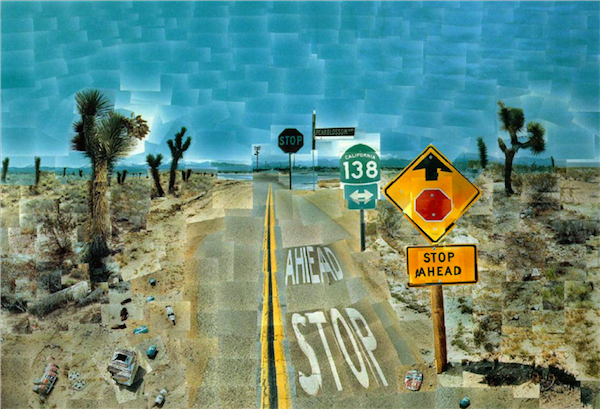

## Output 2020

The assignments consistsed of three parts: Analysis, Evaluate and Create. We will show some of the Analysis and Evaluate work in the video's around each artwork that we publish later. However, the Create assignment is made to be shared online! You may miss some comments/explanation, they are in the deliverables but we cannot share them. A nice point for improvement for next year! 

## P5 sketches
The P5 sketches from the Create 

:-------------------------|:-------------------------
:-------------------------|:-------------------------
 [source (reverse image search)](https://images.google.com/searchbyimage?image_url=https://visualcommunicationdesign.github.io/content/2020/Jasper_Johns.jpg) [p5 sketch 1](https://editor.p5js.org/Steffan_Roskam/full/hsmGrB_Lj) [p5 sketch 2](https://editor.p5js.org/JuliaBeckmann/full/1dedT3O_X)| [source (reverse image search)](https://images.google.com/searchbyimage?image_url=https://visualcommunicationdesign.github.io/content/2020/Cory_Arcangel.jpeg) [p5 sketch 1](https://editor.p5js.org/ahemerik/full/qcGn2VHvT)
:-------------------------|:-------------------------
 [source (reverse image search)](https://images.google.com/searchbyimage?image_url=https://visualcommunicationdesign.github.io/content/2020/Jeff_Koons.jpg) [p5 sketch 1](https://editor.p5js.org/boazvanderkleij/full/y100pdFMy)| [source (reverse image search)](https://images.google.com/searchbyimage?image_url=https://visualcommunicationdesign.github.io/content/2020/Pei-Shen_Qian.jpg) [p5 sketch 1](https://editor.p5js.org/Azurexuan/full/9CdjsKzF8) [p5 sketch 2](https://editor.p5js.org/myronwouts/full/vQvf68-EI) [p5 sketch 3](https://editor.p5js.org/oscarverbeek@gmail.com/full/PLXYqcsEG)
:-------------------------|:-------------------------
 [source (reverse image search)](https://images.google.com/searchbyimage?image_url=https://visualcommunicationdesign.github.io/content/2020/scr2.png) [p5 sketch 1](https://editor.p5js.org/sharda.wolterink/full/QUY8XdpbM) [p5 sketch 2](https://editor.p5js.org/chloe.morningroutine/full/DxpEPatvK)| [source (reverse image search)](https://images.google.com/searchbyimage?image_url=https://visualcommunicationdesign.github.io/content/2020/Prince_Jacon_Osinachi.jpg) [p5 sketch 1](https://editor.p5js.org/suziosaurus/full/4SsiZlh1_) [p5 sketch 2](https://editor.p5js.org/Loes/full/YMyBqG1h5)
:-------------------------|:-------------------------
 [source (reverse image search)](https://images.google.com/searchbyimage?image_url=https://visualcommunicationdesign.github.io/content/2020/Ettore_Sottsass.jpg.jpeg) [p5 sketch 1](https://editor.p5js.org/jaellorenzo/full/KV7d_1M8G)| [source (reverse image search)](https://images.google.com/searchbyimage?image_url=https://visualcommunicationdesign.github.io/content/2020/Peter_Dreher.jpg) [p5 sketch 1](https://editor.p5js.org/coosje.gispen/full/xvyEDEg6R) [p5 sketch 2](https://editor.p5js.org/mikelaguirreu/full/RYXmBhLw8) [p5 sketch 3](https://editor.p5js.org/jiadoudo1/full/mWvDaRFvg)
:-------------------------|:-------------------------
 [source (reverse image search)](https://images.google.com/searchbyimage?image_url=https://visualcommunicationdesign.github.io/content/2020/Alex_Tew.png) [p5 sketch 1](https://editor.p5js.org/SolarCola/full/JTlMd5-zz)| [source (reverse image search)](https://images.google.com/searchbyimage?image_url=https://visualcommunicationdesign.github.io/content/2020/Redditors.png) [p5 sketch 1](https://editor.p5js.org/DanielH/full/bboqMshLX)
:-------------------------|:-------------------------
 [source (reverse image search)](https://images.google.com/searchbyimage?image_url=https://visualcommunicationdesign.github.io/content/2020/avercamp.png) [p5 sketch 1](https://editor.p5js.org/rosettachan/full/f3PSsKNxM)| [source (reverse image search)](https://images.google.com/searchbyimage?image_url=https://visualcommunicationdesign.github.io/content/2020/Nathaniel_Mary_Quinn.png) [p5 sketch 1](https://editor.p5js.org/JoMa/full/DnfIY2o-f) [p5 sketch 2](https://editor.p5js.org/LottevdJagt/full/FNMH1TUQD) [p5 sketch 3](https://editor.p5js.org/sdideriksen/full/XnVeIMPkB) [p5 sketch 4](https://editor.p5js.org/nurnic/full/WmiS52IJb) [p5 sketch 5](https://editor.p5js.org/Vic_Bo/full/8dZGbi135)
:-------------------------|:-------------------------
 [source (reverse image search)](https://images.google.com/searchbyimage?image_url=https://visualcommunicationdesign.github.io/content/2020/Mario_Klingemann.png) [p5 sketch 1](https://editor.p5js.org/amydend/sketches/2YimRkC_B)| [source (reverse image search)](https://images.google.com/searchbyimage?image_url=https://visualcommunicationdesign.github.io/content/2020/SK-A-646.jpg) [p5 sketch 1](https://editor.p5js.org/aronv/sketches/YSeBkfCYU)
:-------------------------|:-------------------------
 [source (reverse image search)](https://images.google.com/searchbyimage?image_url=https://visualcommunicationdesign.github.io/content/2020/Jenny_Saville.jpeg) [p5 sketch 1](https://editor.p5js.org/padaduez/full/lRC1oB5vD)| [source (reverse image search)](https://images.google.com/searchbyimage?image_url=https://visualcommunicationdesign.github.io/content/2020/Sebastien_Errazuriz_and_Cross_Lab_Studio.png) [p5 sketch 1](https://editor.p5js.org/Neuronqd/full/1f75kfiHF) [p5 sketch 2](https://editor.p5js.org/wanyanchengtao/full/bXCXqPiq1) [p5 sketch 3](https://editor.p5js.org/Titimarq/full/wxFtWJq08)
:-------------------------|:-------------------------
 [source (reverse image search)](https://images.google.com/searchbyimage?image_url=https://visualcommunicationdesign.github.io/content/2020/RP-F-K89529.jpg) [p5 sketch 1](https://editor.p5js.org/mohgt540/present/7qHHJSUM4)| [source (reverse image search)](https://images.google.com/searchbyimage?image_url=https://visualcommunicationdesign.github.io/content/2020/David_Hockney.png) [p5 sketch 1](https://editor.p5js.org/Yvon/full/aHbFdcCq4) [p5 sketch 2](https://editor.p5js.org/IreneG/full/3K0Ui9hTp) [p5 sketch 3](https://editor.p5js.org/jadasuchfun/full/-Lej9_Nam) [p5 sketch 4](https://editor.p5js.org/Kaylavalerie5/full/vI3VxxYip)
:-------------------------|:-------------------------
 [source (reverse image search)](https://images.google.com/searchbyimage?image_url=https://visualcommunicationdesign.github.io/content/2020/exhibition-hockney-van-gogh-museum.jpg) [p5 sketch 1](https://editor.p5js.org/Jet/full/Gi1JtxEM-) [p5 sketch 2](https://editor.p5js.org/schmarjolein/full/_SwzUI2On) [p5 sketch 3](https://editor.p5js.org/lichengtian98/full/bevm0D3lv) [p5 sketch 4](https://editor.p5js.org/caspersmits/full/5jQDAGVL2)| [source (reverse image search)](https://images.google.com/searchbyimage?image_url=https://visualcommunicationdesign.github.io/content/2020/Yayoi_Kusama.jpg) [p5 sketch 1](https://editor.p5js.org/Willemijn1/full/zNife86gZ) [p5 sketch 2](https://editor.p5js.org/paulineeshuis/full/YV3O-qShn) [p5 sketch 3](https://editor.p5js.org/PeiyueJiang/full/R0MMlUvWt) [p5 sketch 4](https://editor.p5js.org/OzanAksun/full/1QIR3sCky)
:-------------------------|:-------------------------
 [source (reverse image search)](https://images.google.com/searchbyimage?image_url=https://visualcommunicationdesign.github.io/content/2020/Cheri_Samba.png) [p5 sketch 1](https://editor.p5js.org/PuckGraffner/full/NOTK-xfIs)| [source (reverse image search)](https://images.google.com/searchbyimage?image_url=https://visualcommunicationdesign.github.io/content/2020/Bodys_Isek_Kingelez.png) [p5 sketch 1](https://editor.p5js.org/nicemustang/full/IhuTNHrgt) [p5 sketch 2](https://editor.p5js.org/lsj970911/full/g4zDmtond)
:-------------------------|:-------------------------
 [source (reverse image search)](https://images.google.com/searchbyimage?image_url=https://visualcommunicationdesign.github.io/content/2020/Mike_Pelletier.jpg) [p5 sketch 1](https://editor.p5js.org/cullerrrrchen/full/-4cphlpyN)| [source (reverse image search)](https://images.google.com/searchbyimage?image_url=https://visualcommunicationdesign.github.io/content/2020/broersen-lukacs.jpg) [p5 sketch 1](https://editor.p5js.org/mingzalieu@gmail.com/full/xpV1jBv6a)
:-------------------------|:-------------------------
 [source (reverse image search)](https://images.google.com/searchbyimage?image_url=https://visualcommunicationdesign.github.io/content/2020/Leon_Harmon_and_Ken_Knowlton.jpg) [p5 sketch 1](https://editor.p5js.org/meganchan/full/liAVFUzjOb)| [source (reverse image search)](https://images.google.com/searchbyimage?image_url=https://visualcommunicationdesign.github.io/content/2020/Disney.jpg) [p5 sketch 1](https://editor.p5js.org/paula.bones/full/vTtJSDGit) [p5 sketch 2](https://editor.p5js.org/n.mastenbroek/full/r69SxSaF2)
:-------------------------|:-------------------------
 [source (reverse image search)](https://images.google.com/searchbyimage?image_url=https://visualcommunicationdesign.github.io/content/2020/DP226465.jpg) [p5 sketch 1](https://editor.p5js.org/makbodelier/present/8sQ4-OZje)| [source (reverse image search)](https://images.google.com/searchbyimage?image_url=https://visualcommunicationdesign.github.io/content/2020/Archizoom.jpg) [p5 sketch 1](https://editor.p5js.org/stevengerats/full/caJLOY33N) [p5 sketch 2](https://editor.p5js.org/stopyunn/full/Tq56tLdMt)
:-------------------------|:-------------------------
 [source (reverse image search)](https://images.google.com/searchbyimage?image_url=https://visualcommunicationdesign.github.io/content/2020/scr4.png) [p5 sketch 1](https://editor.p5js.org/Yujie/full/sajiDXdX-)| [source (reverse image search)](https://images.google.com/searchbyimage?image_url=https://visualcommunicationdesign.github.io/content/2020/scr4.png) [p5 sketch 1](https://editor.p5js.org/Yujie/full/sajiDXdX-)

## Change Blindness experiment:
The idea of the change blindess experiment and the puzzles below was born out of (corona) crisis: they were simplefied versions of the Evaluate and Create assignments. Interestingly, you start looking different at images when either doing a puzzle or change blindness work as you will notice below.

Students doing the light version of Evaluate had to design three trials of a change blindness experiment based (easy, medium and hard). Below, we combined all work in three experiments. 

- [easy](https://editor.p5js.org/maartenwijntjes/full/ddcXJyn8N)
- [medium](https://editor.p5js.org/maartenwijntjes/full/QDgQXej-2)
- [hard](https://editor.p5js.org/maartenwijntjes/full/ILhNLNEvY)

## Puzzles

:-------------------------:|:-------------------------:
 [source](https://images.google.com/searchbyimage?image_url=https://visualcommunicationdesign.github.io/content/puzzles/reference/11.jpg)| [source](https://images.google.com/searchbyimage?image_url=https://visualcommunicationdesign.github.io/content/puzzles/reference/12.jpg)
:-------------------------:|:-------------------------:
 [source](https://images.google.com/searchbyimage?image_url=https://visualcommunicationdesign.github.io/content/puzzles/reference/13.jpeg)| [source](https://images.google.com/searchbyimage?image_url=https://visualcommunicationdesign.github.io/content/puzzles/reference/14.jpg)
:-------------------------:|:-------------------------:
 [source](https://images.google.com/searchbyimage?image_url=https://visualcommunicationdesign.github.io/content/puzzles/reference/15.jpg)| [source](https://images.google.com/searchbyimage?image_url=https://visualcommunicationdesign.github.io/content/puzzles/reference/16.jpg)
:-------------------------:|:-------------------------:
 [source](https://images.google.com/searchbyimage?image_url=https://visualcommunicationdesign.github.io/content/puzzles/reference/17.jpg)| [source](https://images.google.com/searchbyimage?image_url=https://visualcommunicationdesign.github.io/content/puzzles/reference/19.jpg)
:-------------------------:|:-------------------------:
 [source](https://images.google.com/searchbyimage?image_url=https://visualcommunicationdesign.github.io/content/puzzles/reference/20.png)| [source](https://images.google.com/searchbyimage?image_url=https://visualcommunicationdesign.github.io/content/puzzles/reference/21.png)
:-------------------------:|:-------------------------:
 [source](https://images.google.com/searchbyimage?image_url=https://visualcommunicationdesign.github.io/content/puzzles/reference/22.png)| [source](https://images.google.com/searchbyimage?image_url=https://visualcommunicationdesign.github.io/content/puzzles/reference/25.jpg)
:-------------------------:|:-------------------------:
 [source](https://images.google.com/searchbyimage?image_url=https://visualcommunicationdesign.github.io/content/puzzles/reference/26.png)| [source](https://images.google.com/searchbyimage?image_url=https://visualcommunicationdesign.github.io/content/puzzles/reference/27.png)
:-------------------------:|:-------------------------:
 [source](https://images.google.com/searchbyimage?image_url=https://visualcommunicationdesign.github.io/content/puzzles/reference/29.jpg)| [source](https://images.google.com/searchbyimage?image_url=https://visualcommunicationdesign.github.io/content/puzzles/reference/2.jpg)
:-------------------------:|:-------------------------:
 [source](https://images.google.com/searchbyimage?image_url=https://visualcommunicationdesign.github.io/content/puzzles/reference/34.png)| [source](https://images.google.com/searchbyimage?image_url=https://visualcommunicationdesign.github.io/content/puzzles/reference/35.jpg)
:-------------------------:|:-------------------------:
 [source](https://images.google.com/searchbyimage?image_url=https://visualcommunicationdesign.github.io/content/puzzles/reference/39.png)| [source](https://images.google.com/searchbyimage?image_url=https://visualcommunicationdesign.github.io/content/puzzles/reference/42.jpg)
:-------------------------:|:-------------------------:
 [source](https://images.google.com/searchbyimage?image_url=https://visualcommunicationdesign.github.io/content/puzzles/reference/43.png)| [source](https://images.google.com/searchbyimage?image_url=https://visualcommunicationdesign.github.io/content/puzzles/reference/44.jpg)
:-------------------------:|:-------------------------:
 [source](https://images.google.com/searchbyimage?image_url=https://visualcommunicationdesign.github.io/content/puzzles/reference/45.jpg)| [source](https://images.google.com/searchbyimage?image_url=https://visualcommunicationdesign.github.io/content/puzzles/reference/46.jpg)
:-------------------------:|:-------------------------:
 [source](https://images.google.com/searchbyimage?image_url=https://visualcommunicationdesign.github.io/content/puzzles/reference/49.png)| [source](https://images.google.com/searchbyimage?image_url=https://visualcommunicationdesign.github.io/content/puzzles/reference/4.jpg)
:-------------------------:|:-------------------------:
 [source](https://images.google.com/searchbyimage?image_url=https://visualcommunicationdesign.github.io/content/puzzles/reference/5.jpg)| [source](https://images.google.com/searchbyimage?image_url=https://visualcommunicationdesign.github.io/content/puzzles/reference/6.jpg)
:-------------------------:|:-------------------------:
 [source](https://images.google.com/searchbyimage?image_url=https://visualcommunicationdesign.github.io/content/puzzles/reference/7.png)| [source](https://images.google.com/searchbyimage?image_url=https://visualcommunicationdesign.github.io/content/puzzles/reference/8.jpg)
