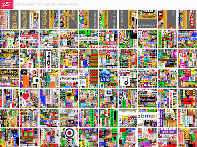
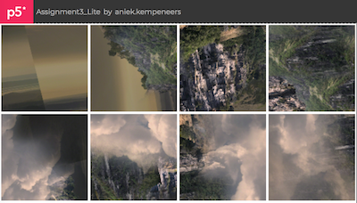

## Output 2020

The assignments consistsed of three parts: Analysis, Evaluate and Create. We will show some of the Analysis and Evaluate work in the video's around each artwork that we publish later. However, the Create assignment is made to be shared online! You may miss some comments/explanation, they are in the deliverables but we cannot share them. A nice point for improvement for next year! 

## P5 sketches
The P5 sketches from the Create 

:-------------------------|:-------------------------
:-------------------------|:-------------------------
 [source (reverse image search)](https://images.google.com/searchbyimage?image_url=https://visualcommunicationdesign.github.io/content/2020/Jasper_Johns.jpg) [p5 sketch 1](https://editor.p5js.org/Steffan_Roskam/full/hsmGrB_Lj) [p5 sketch 2](https://editor.p5js.org/JuliaBeckmann/full/1dedT3O_X)| [source (reverse image search)](https://images.google.com/searchbyimage?image_url=https://visualcommunicationdesign.github.io/content/2020/Cory_Arcangel.jpeg) [p5 sketch 1](https://editor.p5js.org/ahemerik/full/qcGn2VHvT):-------------------------|:-------------------------
 [source (reverse image search)](https://images.google.com/searchbyimage?image_url=https://visualcommunicationdesign.github.io/content/2020/Jeff_Koons.jpg) [p5 sketch 1](https://editor.p5js.org/boazvanderkleij/full/y100pdFMy)| [source (reverse image search)](https://images.google.com/searchbyimage?image_url=https://visualcommunicationdesign.github.io/content/2020/Pei-Shen_Qian.jpg) [p5 sketch 1](https://editor.p5js.org/Azurexuan/full/9CdjsKzF8) [p5 sketch 2](https://editor.p5js.org/myronwouts/full/vQvf68-EI) [p5 sketch 3](https://editor.p5js.org/oscarverbeek@gmail.com/full/PLXYqcsEG)

:-------------------------|:-------------------------
:-------------------------|:-------------------------
   [source (reverse image search)](https://images.google.com/searchbyimage?image_url=https://visualcommunicationdesign.github.io/content/2020/scr4.png)   [p5 sketch 1](https://editor.p5js.org/Jet/present/Gi1JtxEM-)   [p5 sketch 2](https://editor.p5js.org/schmarjolein/full/_SwzUI2On)    [p5 sketch 3](https://editor.p5js.org/lichengtian98/full/bevm0D3lv)   [p5 sketch 4](https://editor.p5js.org/caspersmits/full/5jQDAGVL2)| [source (reverse image search)](https://images.google.com/searchbyimage?image_url=https://visualcommunicationdesign.github.io/content/2020/scr2.png)   [p5 sketch 1](https://editor.p5js.org/sharda.wolterink/full/QUY8XdpbM)   [p5 sketch 2](https://editor.p5js.org/chloe.morningroutine/full/DxpEPatvK)
:-------------------------|:-------------------------
 [search](https://images.google.com/searchbyimage?image_url=https://visualcommunicationdesign.github.io/content/2020/DP226465.jpg)| [search](https://images.google.com/searchbyimage?image_url=https://visualcommunicationdesign.github.io/content/2020/Disney.jpg)

## Change Blindness experiment:
The idea of the change blindess experiment and the puzzles below was born out of (corona) crisis: they were simplefied versions of the Evaluate and Create assignments. Interestingly, you start looking different at images when either doing a puzzle or change blindness work as you will notice below.

Students doing the light version of Evaluate had to design three trials of a change blindness experiment based (easy, medium and hard). Below, we combined all work in three experiments. 

- [easy](https://editor.p5js.org/maartenwijntjes/full/ddcXJyn8N)
- [medium](https://editor.p5js.org/maartenwijntjes/full/QDgQXej-2)
- [hard](https://editor.p5js.org/maartenwijntjes/full/ILhNLNEvY)

## Puzzles

:-------------------------:|:-------------------------:
 [source](https://images.google.com/searchbyimage?image_url=https://visualcommunicationdesign.github.io/content/puzzles/reference/11.jpg)| [source](https://images.google.com/searchbyimage?image_url=https://visualcommunicationdesign.github.io/content/puzzles/reference/12.jpg)
:-------------------------:|:-------------------------:
 [source](https://images.google.com/searchbyimage?image_url=https://visualcommunicationdesign.github.io/content/puzzles/reference/13.jpeg)| [source](https://images.google.com/searchbyimage?image_url=https://visualcommunicationdesign.github.io/content/puzzles/reference/14.jpg)
:-------------------------:|:-------------------------:
 [source](https://images.google.com/searchbyimage?image_url=https://visualcommunicationdesign.github.io/content/puzzles/reference/15.jpg)| [source](https://images.google.com/searchbyimage?image_url=https://visualcommunicationdesign.github.io/content/puzzles/reference/16.jpg)
:-------------------------:|:-------------------------:
 [source](https://images.google.com/searchbyimage?image_url=https://visualcommunicationdesign.github.io/content/puzzles/reference/17.jpg)| [source](https://images.google.com/searchbyimage?image_url=https://visualcommunicationdesign.github.io/content/puzzles/reference/19.jpg)
:-------------------------:|:-------------------------:
 [source](https://images.google.com/searchbyimage?image_url=https://visualcommunicationdesign.github.io/content/puzzles/reference/20.png)| [source](https://images.google.com/searchbyimage?image_url=https://visualcommunicationdesign.github.io/content/puzzles/reference/21.png)
:-------------------------:|:-------------------------:
 [source](https://images.google.com/searchbyimage?image_url=https://visualcommunicationdesign.github.io/content/puzzles/reference/22.png)| [source](https://images.google.com/searchbyimage?image_url=https://visualcommunicationdesign.github.io/content/puzzles/reference/25.jpg)
:-------------------------:|:-------------------------:
 [source](https://images.google.com/searchbyimage?image_url=https://visualcommunicationdesign.github.io/content/puzzles/reference/26.png)| [source](https://images.google.com/searchbyimage?image_url=https://visualcommunicationdesign.github.io/content/puzzles/reference/27.png)
:-------------------------:|:-------------------------:
 [source](https://images.google.com/searchbyimage?image_url=https://visualcommunicationdesign.github.io/content/puzzles/reference/29.jpg)| [source](https://images.google.com/searchbyimage?image_url=https://visualcommunicationdesign.github.io/content/puzzles/reference/2.jpg)
:-------------------------:|:-------------------------:
 [source](https://images.google.com/searchbyimage?image_url=https://visualcommunicationdesign.github.io/content/puzzles/reference/34.png)| [source](https://images.google.com/searchbyimage?image_url=https://visualcommunicationdesign.github.io/content/puzzles/reference/35.jpg)
:-------------------------:|:-------------------------:
 [source](https://images.google.com/searchbyimage?image_url=https://visualcommunicationdesign.github.io/content/puzzles/reference/39.png)| [source](https://images.google.com/searchbyimage?image_url=https://visualcommunicationdesign.github.io/content/puzzles/reference/42.jpg)
:-------------------------:|:-------------------------:
 [source](https://images.google.com/searchbyimage?image_url=https://visualcommunicationdesign.github.io/content/puzzles/reference/43.png)| [source](https://images.google.com/searchbyimage?image_url=https://visualcommunicationdesign.github.io/content/puzzles/reference/44.jpg)
:-------------------------:|:-------------------------:
 [source](https://images.google.com/searchbyimage?image_url=https://visualcommunicationdesign.github.io/content/puzzles/reference/45.jpg)| [source](https://images.google.com/searchbyimage?image_url=https://visualcommunicationdesign.github.io/content/puzzles/reference/46.jpg)
:-------------------------:|:-------------------------:
 [source](https://images.google.com/searchbyimage?image_url=https://visualcommunicationdesign.github.io/content/puzzles/reference/49.png)| [source](https://images.google.com/searchbyimage?image_url=https://visualcommunicationdesign.github.io/content/puzzles/reference/4.jpg)
:-------------------------:|:-------------------------:
 [source](https://images.google.com/searchbyimage?image_url=https://visualcommunicationdesign.github.io/content/puzzles/reference/5.jpg)| [source](https://images.google.com/searchbyimage?image_url=https://visualcommunicationdesign.github.io/content/puzzles/reference/6.jpg)
:-------------------------:|:-------------------------:
 [source](https://images.google.com/searchbyimage?image_url=https://visualcommunicationdesign.github.io/content/puzzles/reference/7.png)| [source](https://images.google.com/searchbyimage?image_url=https://visualcommunicationdesign.github.io/content/puzzles/reference/8.jpg)
